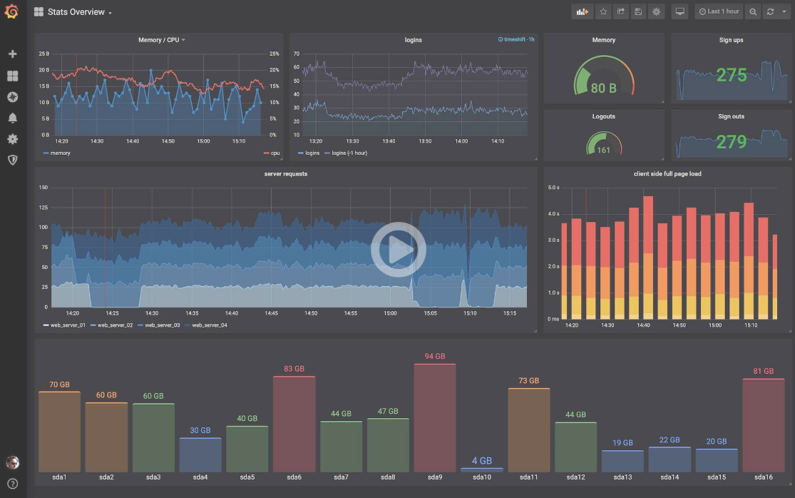

# CFET2-如何迅速提高完成度

<!-- keywords:CFET2;中子源控制系统;2020计划; -->
<!-- description:做一套完整的控制系统的方案其实非常复杂工作量很大。而且自己做的很难实现非常完美的效果，因此碧血借助已经造好的轮子 -->

## 什么一定要自己做

### Core

CFET2 的核心时 RESTful API 表示控制系统的一切，因此把资源暴露成 HTTP RESTful API 这个是自己做，而且已近做好了

### 脉冲数据采集与存储尤其是 Scope

这个脉冲的实验数据时这种脉冲实验性质特有的，尤其是非常高频的时间序列数据的可视化，这个我在 JScope 之外就没有看到过。还有 MDSPlus 这种脉冲实验存储和管理也是别处没有的。

所以我们的 Tag Server 还有 DAQ-pusle 这个要自己做。然后 ploty-scope 也要自己做，这个也是别处没有的。不过离用 Ploty 可以开快狠多。

### Widget-UI

这个改一改别人的好像也可以，你们找找有没有合适的。不过该别人的可能也很麻烦，主要是我们的 sample 带有 metadata 利用这个数据挺麻烦的。先自己做吧，做的越简单越好，只要满足一个基本的控制系统的操控就可以了。当然上面提到的 scope 也是 Widget-UI 里面的重要、大头。

### 基本的状态机和脚本

这个存粹时为了实验流程控制，这个 keep it minimum，保证实验能够灵活的开展就可以了。

总之以上就是之前计划里面也提到的。

## 什么可以利用别人的

## Docker

这个不算用别人的，就是我我们这些做的都需要用 Docker 来部署 Portainer 管理，这个是必须的。

## FluxBD

这个只用来尊工程数据的，就是非脉冲实验数据。以前我们用的 MongoDB，现在有个专门的就是 FluxDB，这个有很多周边工具可以用来帮助我们课时话和分析。这样就不需要 Plotly-Scope 来作工程数据的适配了。

## Grafana

这个可以配合 FluxBD 瞬间就实现工程、时间序列数据的可视化。

这个你们还可以研究一下，grafana 能不能当 scope 用，我觉得肯定是不行的。

## Node-Red

这个可以拖拖拽拽就是先编程，主要是可以实现很多和别的系统的对接，这个非常重要，可以瞬间让 CFET2 和其他系统连接起来。

这个的关键就是要自己写几个 Node，来实 GET SET Invoke 还有订阅事件。非常简单。
