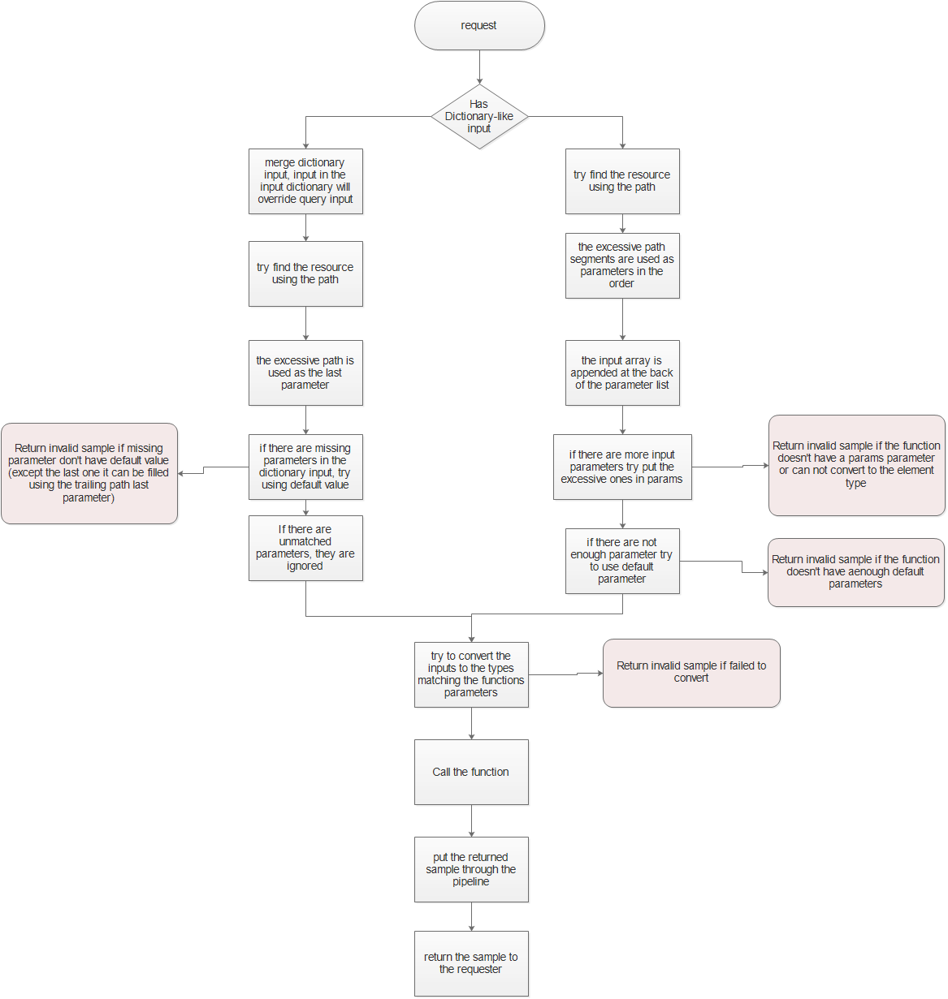

# How to access resources in CFET2


The above image shows how data access happens in CFET2. There are2 types of access local and remote. in the image, the local access call stack is marked as red, the remote is green. the arrows shows how the request is propagated to the thing that has the resource you requested. See [How to Make a CFET2 Communication Module](#how-to-make-a-cfet2-communication-module) for details. Now let just look how to compose a request to a CFET2 resource.

## Accessing using Hub or accessing using plain old HTTP

When you are in a Thing that is mounted to a CFET App, you have access to the hub object, you can use it to access resources in this cfet app or in a remote cfet app. But when you are not, you will have to use a HTTP client to get the resource. Do not mix this 2. Using http to access resource is extremely simple, we could not find a reason to provide a library as you http client of all sorts.

Down below we first introduced how to using the hub way, by this way we can get you familiar with some concept. Then we will show you how to using http client.

## Actions

When accessing resources, you need to specify the action.

1. Get: you can use get on Status, Config. Depending on your setup, you can also use get on Thing or Method. This will not git you a valid sample, but you can get metadata or navigational data.

2. Set: you can set a Config, to set a new value to the Config. the returned sample is the latest value of the Config (same as performing a get immediately after the set).

3. Invoke: you can invoke a method. the returned value depends on the method implementation.

When using http, tha above 3 map s to corresponding http verbs.

* get:get
* set:put
* invoke:post

## Using Hub

```csharp
public ISample TryAccessResourceSampleWithUri(ResourceRequest request)
```
When you are requesting resource in a thing you can access the hub as a property `MyHub`. Then you can use access method on the hub.

```csharp
public ResourceRequest(string uri,AccessAction action, object[] inputarray, 
            Dictionary<string, object> inputdict, Dictionary<string, string> extraRequest, 
            bool usingdict = false)
```

Before making access request you have to make a request object. It is simple, as show above, most time you will just need the `uri` and the action. For the action you have `public enum AccessAction { get,set,invoke};` to choose from.

When you making a request it is like using a remote remote procedure call to a function of a object in a control system. The URI not only specifies the location of the function or property but it also can have parameters in it just like restful APIs (shown later). If -in rare case- you need complex parameters you can put them in a dictionary or in an array, just link when you making HTTP request and put some parameters in the request body or form.

### Using Only the URI path

When you don't have complex type as parameter you can just use the **URI path**. 

For example you have a status implementation like:
```csharp
        [Cfet2Status]
        public int Temp(int channel, string unit)
```
Assume it belongs to a thing name `tempSensor`, and mounted at `/building1/`.

The path to the resource is `/building1/tempsensor/temp`. Note here the path when accessing resource is not case sensitive. Suppose the sensor have many channels and a parameter to specify the unit as C or F. 

Like you want the temperature of the channel 3 in Celsius you can simplly:
```csharp
    MyHub.TryAccessResourceSampleWithUri(new ResourceRequest(
        "/building1/tempsensor/temp/3/c", 
        AccessAction.get,
        null,null,null
        ));
```
Simple right? Just give the path and put the parameters at last, note that the must match the order and the number of the function that implement the resource. if the resource is implemented by property than no parameter is needed.

The Hub matches the resource using the path backward. This means it first tries to find is a resource "/building1/tempsensor/temp/3/c". If not match, the "/c" is considered as a parameter and it tries to match a resource at "/building1/tempsensor/temp/3". In the above example it find a resource at "/building1/tempsensor/temp" so the parameter is "3, c". CFET will convert to the suitable types, see [Convert](#convert) for detail.

### More Complex request

Suppose you have a thing that has a function implements a status:

```csharp
    [Cfet2Status]
    public int Status(string a,string b="b",string c="c", params string[] d=null)
    {
        some logic...
    }
```
That is probably as complex as you may get. And this thing is mounted at `/thing`. So you can use the following way to request this request this resource.

1. `/thing/status/a`, this will call Status("a")
2. `/thing/status/a/x`, this wll call Status("a", "x")
3. `/thing/status/a/x/y/z/z` ,this will call Status("a", "x", "y", "z", "z"), the excessive segment will be put to the params parameter.
4. `/thing/status` this will give an invalid sample, you don't have enough input.

The trailing segments in the url after the path matched to t resource is called array input, each segment is a array input element.

If the function you have does not have a params parameter and you give more parameters it wants it will error out and give you an invalid sample. Such as 
for `public int Status(string a,string b="b",string c="c")`, this will error: `/thing/status/a/x/y/z/z`.

And you can also use dictionary like inputs,suck as using query string. But you must NOTE, when using dictionary, the array input will be joined with "/" and put to the last parameters

1. `/thing/status?a=a`, this will call Status("a")
2. `/thing/status?a=a&b=x`, this will call Status("a", "x")
3. `/thing/status?a=a&x=x`, this will call Status("a"), when you have excessive input in the query string, it will be ignored.
4. `/thing/status?a=a&c=y`, this will call Status("a","b","y"), you can skip parameters with default values, not matter the order.
5. `/thing/status/a/b/c?a=a&c=y`, this will call Status("a", "b", "y", "/a/b/c"), when using query string, the path segment is not mapped to parameters. If there are excessive path, it will be put to the last parameter as a whole.
6. `/thing/status?b=a`, this will call error, you are missing a input.

### array input and dictionary input

When you have complex input that can't be put into a URI, you can put them in Dictionary input or array input.

Just like below, not you can use either one of them but not both.

```csharp
public ResourceRequest(string uri,AccessAction action, object[] inputarray, 
            Dictionary<string, object> inputdict, Dictionary<string, string> extraRequest, 
            bool usingdict = false)
```

The array input is just like the trailing path segment, when using them both the array input will be append to the path segment:

```csharp
new ResourceRequest(
        "/thing/status/a", 
        AccessAction.get,
        new object[]{"x","y"},null,null
        )
```

The above will call `Status("a", "x", "y")`

When using the dictionary input, the value in the dictionary is merged with the query string, and override them:

```csharp
new ResourceRequest(
        "/thing/status?a=a", 
        AccessAction.get,
        null,
        new Dictionary<string,object>(){{"a","q"},{"b","x"}},
        null,true
        )
```

The above will call `Status("q", "x", "y")`

Note that when using query string is a just like dictionary input. When using them, the path segment parameters will be put to the last:

```csharp
new ResourceRequest(
        "/thing/status/a/b", 
        AccessAction.get,
        null,
        new Dictionary<string,object>(){{"a","q"},{"b","x"}},
        null,true
        )
```

The above will call `Status("q", "x", "y","/a/b")`

The below figure sums it up:



### if the resource is implemented by property

Other than function it is very common for a Thing to implement status or config using property. When using property there is no input when getting, and one and only one input for setting a config.

```csharp
    [Cfet2Config]
    public int Config1 { get; set; } = 1;
```

Suppose the thing is mounted as /Thing

You can get with `/thing/config1`, and you can set it to 2 by `/thing/config1/2`. The first and only input when setting if the value to be set.

## Convert
The CFET2 will handles the type conversion. 

```csharp
var sample= MyHub.TrySetResourceSampleWithUri("/building1/tempsensor", new int[]{5} );

var sample= MyHub.TrySetResourceSampleWithUri("/building1/tempsensor", new string[]{"5"} );
```
The above is the same. It even works on POCO object. When type is not matching, CFET2 will serialize you input into JSON and tye de-serialize them into the target type.

## Using HTTP

The HTTP server support is provided by the NancyCommunicationModule which is part of the CfetCore.

When requesting, you can use any http client. Currently the NancyCommunicationModule only support embedding parameters in URL, soon it will support complex input parameter in the body just like array input and dictionary input.