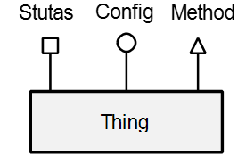
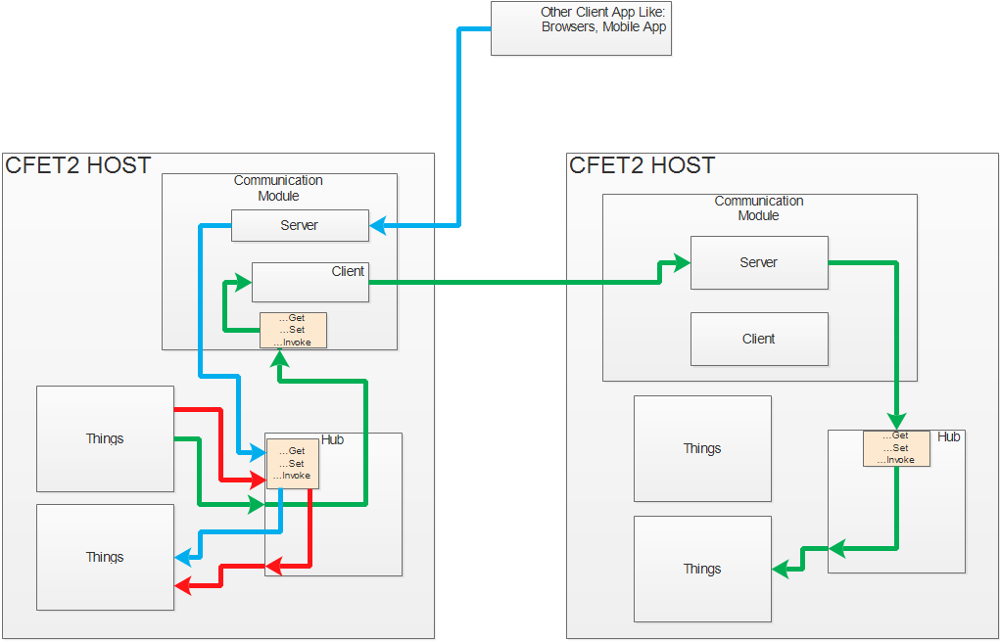

# Getting Started With CFET2

## What is CFET2?

CFET2 is a control system framework, which allow user to plug their &quot;thing&quot; into the CFET2 app, and the CFET2 app will allowed others to access the resource on them. Like you developed a lamp controller, and others can access the switch of it via CFET2. But how? This is something the person who developed the lamp controller need not to concern, the CFET2 takes care of it.

## Why CFET2

As stated above, one develop some &quot;thing&quot; need not to think about how others are going to access it. You just focus on the main business logic of you &quot;thing&quot;, like how to control a relay that controls the lamp. How other access this function like via MQTT, CoAP, HTTP RESTful, Bluetooth or ZigBee, those protocol or media are completely out of the developer&#39;s concern. They are taken care by CFET2.

## Basic Concept

### Thing

You see the CFET2 is design to be a control framework for every&quot;thing&quot;. It&#39;s for Internet of Thing and Web of Things. Then what is a "Thing";?

A thing is an object that has resources that can be accessed by the others. Like a light is a thing, it has a switch to toggle on off, it may have a brightness tune. Or a person who have his name we can refer. So everything can be a thing. Then it&#39;s impossible to work with them if we don&#39;t find stuff they have in common. So we have thing abstraction.

The image shown below is a thing abstraction, it has 3 resource we can access. So if everything can only has those 3 resources, CFET2 can manage them. More about the 3 resources later.


 
**From CFET2 programming perspective:**  **a thing is an object that has properties or method marked as status, config or method.** You define a class that implement you business logic, and mark some properties and method to be those resource for others to access, that&#39;s so called a thing. CFET2 will handle accessing of this resource.

### Resources

Thing, Status, Config, Method, those are resources. The resource contains useful information about the thing. Like a brightness of a lamp is a resource of the lamp. The thing is self is also a resource, but we do not access the thing directly, we access its resources as said the status, config and method.

### Status

A thing may have a set of status. Status is a property that others can observe but cannot change. It can only be changed by a thing itself. It represent the current states of a thing that the thing wants others to know. All the information others needs to know should be made into status. And by looking at the statuses solely, one can determine all the output and behavior of the thing. Of course a thing may hide internal states that other don&#39;t need. This is not status.

**From CFET2 programming perspective: a status is a property or a method of a class that returns a value.** The status may not be read only or have only getter, from the CFET2 app, other can only get the value in the property. If a method are marked as status, it must have a return value represent the status value. Also it&#39;s not enforced by (and cannot) CFET2 that a status should not change anything in the thing but it should not be! Just simply return the corresponding value. You can pass parameters to a status, more about this later in [How to Make a CFET2 Thing](#how-to-make-a-CFET2-thing) section.

### Config

A thing may have a set of configurations. Configuration is a property that the thing it self cannot change but can only be changed by others. It represents how the others want the thing to behave, and the supported behaviors of this thing.

The effect of configuration changes will take place based on the things designated behavior. The above is to say configuration does not necessarily tells how a thing should behave, and others cannot determine the output of the thing by looking at the configurations (should by looking at status). Once a configuration changes, it may result in a transitional state of thing. It takes time for a thing to transit from one set of configurations to another. But the transition will definitely be presented in statutes. Moreover in some situations, one may want to change a number of configuration than let the change take place instead of change the behavior in the middle of these changes. So the thing may not apply these configuration change until a method is called.

**From CFET2 programming perspective: a config is a property or a method of a class that accept a value and returns a value.** The most obvious config can be a property that are public get and set. But it need not to be. It can be a get only property plus a set only property. It can be method accept a value and change value in the thing. More about this later in [How to Make a CFET2 Thing](#how-to-make-a-CFET2-thing) section.

### Method

A thing may have a set of methods. A method is a command like property, like a method of member function in OOP. A method is a command to a thing that it must react to it immediately. A method can accept parameter or not. The result of a method may depends on statuses and configuration. A method may or may not acknowledge the caller.

**From CFET2 programming perspective: A method is a method of a class. It can accept parameters or not, or return values or not.** The method can return values to indicate the execution status or is a fire and forget method. The result of the method will be presented via status (this depends on the internal logic of the thing)

### Sample

Sample is a little bit hard to understand. The above mentioned resource, is something you can access. When I say access you are often expecting to get something back from it. Like getting the lamp's brightness status will return a value like "150 lux". How is the value presented to the users of CFET2? Via samples. Sample is a wrapper object that hold a specific value of the status or config or a method invoking result.

**From CFET2 programming perspective: A simple is a object you get when access a status. It contain the value of a status at the time you accessed the resource.** Continue with the example above, the "150" is the value of the sample return by get the the lamp's brightness status. you get get is via: `sample.Val;` A sample besides the value could have many other properties like the unit for the above is "lux" which may get via `sample.Unit;`. There are different types of sample, having different property. But all the useful value is stored in the sample context which is a `Dictionary<string,object>`. Thing developer may not care about the details of a sample, you just remember you resource value are wrapped in sample, when you need the resource value use code like  `sample.Val;`.

### Resource Accessing

We have said lots about accessing resources, what is it exactly? 

To access a resource you need 3 things：**action, path, input**.

1. **Action**
   
   Different types of resources will support different kinds of actions.

   **Get:** Status, Config support this action, this means to get the current value from the resource, no change should be made to the thing. Like simply return a value. In future versions of CFET2, method may support this action. You can pass input the status. Like a LED lamp array thing, its brightness status may accept a input to specify which LED's brightness you want to get.

   **Set:** Only Config support this action. You have to provide at least one input as the value to be set to the Config. Of course you can provide more inputs if the config accept if but only one can be the value to set the rest is like input in status, used to specify the sub portion of a resource.

   **Invoke** Only Method support this action. It's very like get, you can provide none or any number of input like get. It will invoke a method. the returned sample may not have a value depends on the thing implementation.

2. **Path**

   Path is a path lead to a resource, like "\room103\airconditioner1\tempset". It locate a resource.

3. **Input**

   Some resources may require input, like the Config need at least one input to be set. Some may require some input to specify a sub portion of a resource to be accessed. Like an analog I/O device could have a status called "analogInput". But it may have multiple channels, to access the channel 1 value, you have to provide a input specify that.

4. **Route**

   Here is a new concept. Route is not a basic thing you need to access Resource, it is a URI that you can use to access the resource. It combines the path and some or all the input you need. Like http://localhost/room103/analogInput?channel=1. This combine the input and path. More about it in [How to Make a CFET2 Thing](#how-to-make-a-CFET2-thing) section.

### Hub

Hub is a object get injected into you thing, so you have CFET2 service to consume. You normally use hub to access resource.

```csharp
       public ISample TryGetResourceSampleWithUri(string requestUri, Dictionary<string, object> inputDict);
       public ISample TryGetResourceSampleWithUri(string requestUri, params object[] inputs);
       public ISample TryInvokeSampleResourceWithUri(string requestUri, Dictionary<string, bject> inputDict);
       public ISample TryInvokeSampleResourceWithUri(string requestUri, params object[] nputs);
       public ISample TrySetResourceSampleWithUri(string requestUri, Dictionary<string, bject> inputDict);
       public ISample TrySetResourceSampleWithUri(string requestUri, params object[] inputs);
```
The requestUri is the Route mentioned above. The reset is the input.

Everything or other object that need a hub will get in by injection. Everything get a unique instance of the hub, this is because of permission control. Later versions of CFET2 will inject hub  with different access right to control the rights a thing can get.

### Communication Module

CFET2 takes care the resource accessing between things in the same CFET2 host out of box. But what about things in different hosts (apps)? They are handled by **communication  modules (CM)**. You can Inject multiple CM in host when you are request a resource that is remote you use a URI point to a remote resource like "http://example.com/room103/aireconditioner/temp". The hub will use the CM that handles http protocol to get access the resource. More about this on [How to Make a CFET2 Communication Module](#how-to-Make-a-cfet2-communication-module).

### CFET2 Host

CFET2 host is a object that set up a the modules needed to run a CFET2 app. It will create things, injected it into the hub, create CM and start everything. Not that a CFET2 app can only have one host object.

## How to Make a CFET2 Thing

Finally we are here.

### Basic Ideas
1. Focus on you thing's business logic, and leave others to CFET2.
2. Before you start, read through above sections, get a basic idea of what is status, config and method, so when you are making your thing, you know what property and method will become those resource. This is very important. Even if you are not making a CFET2 thing, the status, config and method principle will apply to most control system component.
3. Your thing will inherit from the `Jtext103.CFET2.Core.Thing` class, so if you thing will have to inherit from other class in order to get its business done, wrap it with a "thing" class that inherit the `Jtext103.CFET2.Core.Thing` and write few methods and properties to map the inner object to your CFET2 thing.
4. Only thing left is to decorate you thing's properties and method with CFET2 attribute. In fact you can make a already existing class into CFET2 thing in just 2 steps: 1. inherit from `Jtext103.CFET2.Core.Thing`; 2. decorate with CFET2 attribute.
5. One thing to be bearing in mind is that, anything you decorated with CFET2 attribute should not block the thread, it should return as fast as possible, open a thread to do heavy lifting stuff.

### Status
Status is simple. Just decorate a property of method that has a return with `Jtext103.CFET2.Core.Attributes.Cfet2StatusAttribute`. For status, config and method, the property and method with CFET2 Attribute is called a resource implementation.

Example:
```csharp
        //the simplest way
        [Cfet2Status]
        public int StatusP { get; set; } = 10;
        
        //the Name is the status name, if you dont provide it, it will be the Method name: StatusM1
        [Cfet2Status(Name = "Status")]
        public ISample StatusM1()
        {
            return ("Nothing!").ToStatus();
        }

        //Here the status name is StatusWithParams
        [Cfet2Status]
        public string StatusWithParams(int n,string n2)
        {
            return n.ToString()+n2;
        }

        //Here the status name is StatusWithOneParam
        //you see, you can have overload methods marked as status, but you have to give them different names.
        [Cfet2Status(Name = "StatusWithOneParam")]
        public string StatusWithParams(int n)
        {
            return n.ToString()+n2;
        }

        //more realistic
        [Cfet2Status]
        public string AnalogInput(int channelNo)
        {
            return getAnalogValueFromDAQCard(channelNo);
        }
```
One thing to remember is that a thing cannot have two resource of the same name, even they are of different type.

You can see that the method marked as status can have parameters, those parameters will become inputs of the status.

### Config
Config is a little bit complicated. Config support 2 actions, get and set. For get, it is the same as status. And if the property is public get set, then the set is also implemented. e.g.:
```csharp
        [Cfet2Config]
        public int ConfigInt { get; set; } = 1;
```
The above code will have a config named ConfigInt. Others can get or set it's value.

But, when you have a method return a value, and you want to use it when others get the config, and a method accept a value to set the config, how to do that? like below:
```csharp
        //for the get we have one input, this is use to locate which sub portion we need of this config
        [Cfet2Config(ConfigActions = ConfigAction.Get, Name = "ConfigDict")]
        public int ConfigDictGet(string loc)
        {
            return configDict[loc];
        }

        //for the set of the same config, we have two input, 
        //one have the same usage of the input above, the other is to set the config value.
        [Cfet2Config(ConfigActions = ConfigAction.Set, Name = "ConfigDict")]
        public void ConfigDictSet(string loc,int val)
        {
            configDict[loc1+loc2] = val;
        }
```
From the code above you can see we have two method but they all implement the same config, one for get, the other for set. This separate implementation not just work for method they also work for property and you can mix them:

Get is property set is method:
```csharp
        //
        //we can use the default property  name as well
        [Cfet2Config(ConfigActions = ConfigAction.Get)]
        public int Config2
        {
            get
            {
                return con2 * 10;
            }
        }

        //the set for "Config2"
        [Cfet2Config(ConfigActions = ConfigAction.Set, Name = "Config2")]
        public void Config2Set(int val)
        {
            con2 = val;
        }

```
Get is method  set is method:
```csharp
        [Cfet2Config(ConfigActions = ConfigAction.Set, Name = "Config3")]
        public int Config3
        {
            set
            {
                con3 = value;
            }
        }

        [Cfet2Config(ConfigActions = ConfigAction.Get, Name = "Config3")]
        public int Config3Get()
        {
            return con3 * 10;
        }
```
If you don't specify the action, then you can only mark a property with public get and set as config. But if you have the action specified as "get", then it can be a property with public get or a method returns a value. If you have the action specified as "set", then you can have property that has public set or method accepting at least one parameter marked as the config. But bear in mind that if you have the action specified, you have to use them in pair. One `ConfigAction.Get` must have a `ConfigAction.Set`, and the config name must be the same (can use the default name).

Another thing about config is the method or property marked as config with `ConfigAction.Set`, the return value is not used bu CFET2. When you set a config you do get a sample of the newly set config, but it is fetched using the get action of the config. Like the above code, you set the Config3 to be 10, and the sample you get by this action is 30. Note, this is very un-recommended, it's confusing. It would be better if you store the processed value in an internal variable.

### Method

Implementing a method is just like implementing status. Only different is that method does not require a returned value. But if you have a returned value, it's ok it will be send to the one who invoked this as a sample.

```csharp
        [Cfet2Method]
        public string MethodJoin(string s1, string s2, string s3)
        {
            if (s1 == null)
            {
                return null;
            }
            return String.Join(":", s1, s2, s3);
        }

        //If your method took long to finish, wrap it in an async method, do not block
        [Cfet2Method]
        public string StartMotor()
        {
            Motor.StartAsync();
            Motor.State="Starting";
        }

```

### More About sample

Previously we talked about sample. But from the above examples of implementations of status, config and method, we see no sample. So where is the sample?

The CFET2 is taken care of the sample stuff. When you return a value from a status like below: 
```csharp
        [Cfet2Status]
        public int StatusP { get; set; } = 10;
```
Your are saying the value of this status is type `int`. When others get the status, somewhere in CFET2 there is line of code like:
```csharp
        yourReturnedValue.ToStatus();
```
This code will wrap you int in a object of type `Status<int>`. `Status<int>` is a derived class from `SampleBase`, it is a sample of a status resource. When users get this sample, they will get it as an `ISample`. Every sample object implemented this interface. You can get the status value from `ISample.ObjectVal` property. The type would be `int`, the return type of StatusP.

More about `ISample ` please see the source code, or the up coming code document.

**So you don't have to return a sample.** CFET2 process pipeline later may add metadata like time stamp to the sample automatically. But if you want to return a custom sample and put your custom metadata to it, it's totally ok. Just return a sample that implemented the `ISample` interface. If you want to design you own type of sample you can refer to [How to Make a Custom Sample](#TBD).

**For exception handling,** if the user provided invalid input or the resource is in a invalid state, the code you invoke in the resource implementation throw a exception, feel free to throw that exception. 

## Thing Live Cycle

This is very easy. Each thing must have constructor that has no parameter. You do minimum stuff here. Then this thing is added to the CFET2 hub. It will get probed immediately, all the resources are created now. The path for the thing is generated and set to the thing and the resource objects. The Hub is injected to the Thing. Then Right after the probing, **the `TryInit(object initObject)` is called.** This is very important, you must initialize you thing in this method, and use the passed in initObject as a configuration. In here you normally setup hardware resources or simply store important configurations for later use. You should not start do useful work here, since the hub and other component may not ready.

Then the other thing goes the same routine as above, until all the things are probed and initialized. Than the communication modules will start. After this, the host will start all the things by **calling the `StartThings()`**.  You must start doing meaningful stuff here, like start DAQ loop by creating new thread, or start listening on port and things like this. **You never block `TryInit(object initObject)` and `StartThings()` methods.**

## How to access resource in CFET2

[See Accessing resource for details.](AccessingResources/AccessingResources.md)

## How to Make a CFET2 Communication Module



Here is the image again.The previous section talked about access but mostly as local. How about remote accessing? You can see the the blue and green arrows are those involves CM. It represents the requests call stack of a resource access.

### How to Determine a Request is a Remote Access request?

In the previous section, all URI used is not a absolute URI, the scheme and the authority parts are missing. Let complete the URI and look at them.
```csharp
//relative uri is for local access, it must start from the "\" root
"/building1/tempsensor/1/2/3/4"

//this is the same as above , since "cfet" scheme is considered as local, 
//the authority part is ignored
"cfet://123.123.123.123:8000/building1/tempsensor/1/2/3/4"

//this is a remote request, even the authority is pointed to the local host. 
//it will use a CM that handles http protocol
"http://127.0.0.1/building1/tempsensor/1/2/3/4"
```
So if CM want to support a protocol, that to say a URI scheme, it must override a property called `ProtocolNames` to return the supported schemes. Like:
```csharp
        public override string[] ProtocolNames =>  new string[]{"http","https"};
```

### Understand the path of remote access


The the green path as example. When you are using hub to access a resource like:
```csharp
        //in the image marked as 1
        //this is called by the requesting thing on the left
        var sample= MyHub.TrySetResourceSampleWithUri("http://192.168.1.5/building1/tempsensor/1/2/3/4");
```
The hub first discover this is a remote access and find the CM that handles HTTP protocol. It will call the same method on the CM, the method you must override, like:
```csharp
        //in the image marked as 2
        //this is called by hub
        yourCommunicationModule.TrySetResourceSampleWithUri("http://192.168.1.5/building1/tempsensor/1/2/3/4");
```
Then in side the CM there is client object that makes a request to a server in another CM  in the corresponding CFET2 host. This is marled as 3 in the image. 

The server will listen on a port for http request. When request arrives it forwards it to the Hub by call the corresponding hub method. The actions to use and the input is embedded in the http request.
```csharp
        //in the image marked as 4
        //this is called by the server on the right
        //NOTICE that the request made by the server is now a local request
        MyHub.TrySetResourceSampleWithUri("/building1/tempsensor/1/2/3/4");
```
**NOTICE that the request made by the server is now a local request.**

Now You should know how to implement a CM? the blue path is the same, just the request is not made by the thing, but by some app that has no hub, so the client object can be stripped out as a client side hub.

To sum up, follow the below guide lines when making a CM:

1. Make a client object that implement the following method:
```csharp
       public ISample TryGetResourceSampleWithUri(string requestUri, Dictionary<string, object> inputDict);
       public ISample TryGetResourceSampleWithUri(string requestUri, params object[] inputs);
       public ISample TryInvokeSampleResourceWithUri(string requestUri, Dictionary<string, bject> inputDict);
       public ISample TryInvokeSampleResourceWithUri(string requestUri, params object[] nputs);
       public ISample TrySetResourceSampleWithUri(string requestUri, Dictionary<string, bject> inputDict);
       public ISample TrySetResourceSampleWithUri(string requestUri, params object[] inputs);
```

2. For the client object, when the above method is called it transform the request into a request that is in its own protocol like a http restful request. The response is a sample of the resource.

3. Make a server that listens on same communication port.

4. When a request comes first determine its action, then determine the input then get the local URI out, at last forms a local request and calls the hub, the returned sample is send back the the client as response.

5. Wrap the client and server into an CM expose the 
```csharp
       public ISample TryGetResourceSampleWithUri(string requestUri, Dictionary<string, object> inputDict);
       public ISample TryGetResourceSampleWithUri(string requestUri, params object[] inputs);
       public ISample TryInvokeSampleResourceWithUri(string requestUri, Dictionary<string, bject> inputDict);
       public ISample TryInvokeSampleResourceWithUri(string requestUri, params object[] nputs);
       public ISample TrySetResourceSampleWithUri(string requestUri, Dictionary<string, bject> inputDict);
       public ISample TrySetResourceSampleWithUri(string requestUri, params object[] inputs);
```
in the client to the CM by overriding the CM methods.